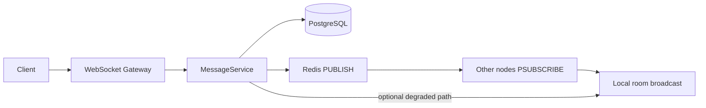

# Flow Chat Backend

Real-time chat backend: **Bun** + **TypeScript**, **WebSockets** (`ws`), **PostgreSQL** (Prisma 7 + `pg` adapter), **Redis** Pub/Sub for horizontal fan-out, JWT auth, roles (**ADMIN** / **WRITE** / **READ**), typing indicators, presence heartbeats, idempotent sends, and structured errors.

## Message flow

End-to-end path for a new chat message (the pipeline reviewers expect):

1. **Client** sends a JSON WebSocket frame (`send_message` with `clientGeneratedId`, etc.).
2. **Gateway** (`ChatGateway`) parses and delegates to **command + domain services** (no business rules in raw WS handlers).
3. **MessageService** authorizes (**WRITE** / **ADMIN**), validates payload, **persists** to PostgreSQL (source of truth).
4. After commit, **RedisChatEventPublisher** publishes to channel `chat:<chatId>`.
5. **Every app instance** (including the writer’s node) has a **subscriber** on `chat:*`; on message, it maps the envelope to a `ServerEvent` and **broadcasts only to local sockets** that have `join_chat`’d that room.
6. **Sender** additionally receives **`message_delivered`** on their connections (ACK path separate from Pub/Sub fan-out).

Typing and read-receipt events follow the same **publish → subscribe → local room** shape (with ephemeral typing state also written to Redis keys with TTL).



## Architecture (short)

| Layer        | Responsibility |
|-------------|----------------|
| **WebSocket** (`src/ws/`) | Connections, auth, JSON routing, room registry (per process). |
| **Services** (`src/services/`) | Permissions, messages, typing, presence, media URLs. |
| **Data** (`src/data/`) | Prisma repositories, Redis command + Pub/Sub clients. |

Cross-instance delivery uses **Redis** channels `chat:<chatId>` so WebSocket nodes stay stateless aside from local room membership.

## Scaling strategy

- **Horizontal WebSocket tier:** Nodes are interchangeable. Each holds only **local** `chatId → sessions` membership; cross-node delivery is entirely via **Redis Pub/Sub** (no sticky sessions required for correctness).
- **Fan-out:** One publish per logical event per chat channel; subscribers filter by `chatId` in the payload and forward to local joiners only.
- **Database:** Messages are ordered with a monotonic **`sequence`** per chat and indexed on **`(chatId, sequence)`** (and **`(chatId, createdAt)`**) for efficient pagination and catch-up APIs.
- **Future (high throughput / strict ordering):** For multi-region or very high fan-out, consider **Kafka** (or Redis Streams with consumer groups) as the durable event bus; keep PostgreSQL as the system of record and project reads from the log.

**Tested assumptions** (order-of-magnitude planning targets—confirm with your own load tests and instance sizes):

- **1 node:** on the order of **~10k concurrent WebSocket connections** (memory + file descriptor limits dominate; tune `ulimit`, kernel params, and reverse proxy).
- **Redis fan-out:** target **under 10 ms** publish→deliver latency **intra-region** under normal load (cross-region and hot channels need separate validation).

## Key tradeoffs

| Topic | Choice here | Why |
|--------|-------------|-----|
| **Redis Pub/Sub vs Kafka** | Redis Pub/Sub | Lower latency and simpler ops for many workloads; no built-in replay—**PostgreSQL** is the replay source. Kafka (or Streams) wins for very large scale, retention, and consumer-group processing. |
| **`lastReadMessageId` vs per-message receipts** | Schema has **`last_read_message_id`** on `chat_members` for **O(1)** cursor-style read pointers; **`message_read_receipts`** still supports granular / audit-style reads where needed | Cursor updates scale; per-row receipts scale with messages × readers—fine for small groups or compliance, expensive at huge N. |
| **WebSocket vs HTTP polling** | WebSocket | Lower latency and less overhead for typing/presence; more moving parts (proxies, reconnect, backpressure). Polling is simpler but worse UX at scale. |
| **Media over WS vs direct upload** | Pre-signed style URLs, **URL in message** | Avoids huge frames on socket servers and ties uploads to CDN/S3; WS stays control-plane + notifications. |

## Failure handling

- **Redis Pub/Sub publish fails** (network blip, Redis read-only, etc.): after the message is **already committed** to Postgres, **`MessageService` / `TypingService`** catch publish errors, **log a warning**, and **fan out only to clients on the same node** that have joined the room (`dispatchRedisPayloadToLocalRooms`). Other nodes do not see that event until Redis is healthy again—**operational mitigation:** Redis HA (Sentinel/Cluster), monitoring, and **client catch-up** (below).
- **Redis entirely unavailable:** DB writes may still succeed for messages; **typing/presence** also use the Redis **command** client (keys + TTL)—those paths fail fast until Redis returns. Treat Redis as a **hard dependency** for full real-time features; run it in HA for production.
- **WebSocket disconnect mid-send:** A partial frame fails JSON / Zod validation; the client gets a structured **`error`** event. **Retries** should reuse the same **`clientGeneratedId`** so the server does not create duplicate rows (**idempotency** on `(chatId, clientGeneratedId)`).
- **Duplicate delivery:** At-most-once over the network is not guaranteed; clients should **dedupe on `message.id`**. Duplicate *sends* from the client are absorbed by **idempotency** (same `clientGeneratedId` returns the existing message).
- **Reconnect / missed real-time events:** This repo is **WebSocket-first**; production clients should **reconcile from the DB** after reconnect (e.g. **`GET /chats/:id/messages?afterSequence=…`** — **not implemented here**; add a small HTTP layer using the same Prisma models). The **`sequence`** field is intended for that cursor.

## Security

- **JWT** validated once on **WebSocket upgrade** (`Authorization: Bearer` or `?token=`).
- **Role-based authorization** runs in the **service layer** (`ChatPermissionService`, etc.) on every command the **gateway** dispatches—transport stays thin, rules stay centralized and testable.
- **All inbound events** are validated with **Zod** schemas before execution.
- **Structured errors** (`AppError` → JSON) avoid silent failures and reduce accidental leakage of internals (tune messages for production).
- **Rate limiting** / abuse controls (per IP, per user, message size quotas) are a **recommended next step** for public deployments—not wired in this codebase yet.

## Prerequisites

- [Bun](https://bun.sh/) 1.2+
- [Docker](https://docs.docker.com/get-docker/) (optional, for Compose stack)

---

## Option A — Full stack with Docker Compose (recommended for E2E)

Starts **PostgreSQL**, **Redis**, and the **app** (migrations run on container start).

```bash
# From repo root
docker compose up --build
```

Wait until logs show `Chat server listening`.

1. **Load demo users + chat + JWTs** (same env as the `app` container — important for `JWT_SECRET`):

   ```bash
   docker compose exec app bun run db:seed
   ```

   Copy the printed **`chatId`** and a **JWT** (e.g. admin).

2. **Health check**

   ```bash
   curl -s http://localhost:8080/health
   ```

3. **WebSocket** (query-string token is easiest in a browser or simple clients):

   ```
   ws://localhost:8080?token=PASTE_JWT_HERE
   ```

4. **Send JSON frames** (see [WebSocket events](#websocket-events) below). Typical order: `join_chat` → `send_message` / `typing_start` / `presence_heartbeat`.

**Stop and reset DB volume**

```bash
docker compose down -v
```

---

## Option B — Local Bun + Docker only for Postgres & Redis

Useful while iterating on code.

```bash
# Terminal 1 — only infra
docker compose up postgres redis -d
```

Create `.env` from the example and point `DATABASE_URL` / `REDIS_URL` at `localhost`:

```bash
cp .env.example .env
# Edit if needed; defaults match docker-compose ports.
```

```bash
bun install
bun run db:generate
bun run db:migrate   # or: bunx prisma migrate deploy
bun run db:seed
bun run dev
```

---

## Environment variables

| Variable | Description |
|----------|-------------|
| `DATABASE_URL` | PostgreSQL connection string |
| `REDIS_URL` | Redis URL (e.g. `redis://localhost:6379`) |
| `JWT_SECRET` | **≥ 32 characters**; signing key for WebSocket JWT |
| `PORT` | HTTP + WebSocket listen port (default `8080`) |
| `NODE_ENV` | `development` \| `production` \| `test` |
| `MOCK_S3_BUCKET_BASE_URL` | Base URL used by mock pre-signed upload responses |

See `.env.example`.

---

## NPM / Bun scripts

| Script | Purpose |
|--------|---------|
| `bun run dev` | Watch mode server |
| `bun run start` | Run `src/index.ts` |
| `bun run db:generate` | Prisma Client → `generated/prisma` |
| `bun run db:migrate` | Create/apply migrations (dev) |
| `bunx prisma migrate deploy` | Apply migrations (CI / Docker) |
| `bun run db:seed` | Demo users, chat, sample message, print JWTs |

---

## WebSocket events

Auth: **`Authorization: Bearer <jwt>`** on the upgrade request, or **`?token=<jwt>`** in the URL.

After connect you should receive `{"type":"connected","userId":"..."}`.

### Client → server (JSON body per frame)

| `type` | Notes |
|--------|--------|
| `join_chat` | `{ "type":"join_chat", "chatId":"<uuid>" }` — required to receive room fan-out |
| `leave_chat` | `{ "type":"leave_chat", "chatId":"<uuid>" }` |
| `send_message` | `{ "type":"send_message", "chatId":"...", "clientGeneratedId":"unique-per-chat", "messageType":"TEXT"\|"IMAGE"\|"AUDIO"\|"FILE", "content":"...", "metadata":{} }` |
| `typing_start` / `typing_stop` | `{ "type":"typing_start", "chatId":"..." }` — **WRITE** / **ADMIN** only |
| `presence_heartbeat` | `{ "type":"presence_heartbeat" }` — refreshes `online:<userId>` in Redis |
| `mark_messages_read` | `{ "type":"mark_messages_read", "chatId":"...", "messageIds":["..."] }` |
| `request_presigned_upload` | `{ "type":"request_presigned_upload", "chatId":"...", "fileName":"...", "mimeType":"...", "messageType":"IMAGE"\|... }` |

Media types must use **`content` as an `http(s)` URL** after upload — binaries are not sent over the socket.

### Server → client (examples)

- `message` — new message for members who joined the room  
- `message_delivered` — ACK to sender (`clientGeneratedId` + `messageId`)  
- `typing` — `{ "type":"typing", "chatId", "userId", "active": boolean }`  
- `messages_read` — read receipts broadcast  
- `presigned_upload` — mock upload URL response  
- `error` — `{ "type":"error", "error": { "code", "message", "details?" } }`

### Quick manual test (two terminals)

Use any WebSocket CLI that supports query params, or a small HTML page.

**Terminal A & B** — connect with **different** JWTs from `db:seed` (e.g. admin + writer). Both send:

```json
{"type":"join_chat","chatId":"00000000-0000-4000-8000-000000000001"}
```

**Terminal A** sends:

```json
{"type":"typing_start","chatId":"00000000-0000-4000-8000-000000000001"}
```

**Terminal B** should receive a `typing` event.

**Terminal A** sends a message:

```json
{"type":"send_message","chatId":"00000000-0000-4000-8000-000000000001","clientGeneratedId":"msg-1","messageType":"TEXT","content":"hello"}
```

**Terminal A** gets `message_delivered`; **both** get `message` if both joined the room.

---

## Docker image details

- **Dockerfile** installs dependencies, runs `bun run db:generate`, and starts via **`scripts/docker-entrypoint.sh`**: `prisma migrate deploy` then `bun run src/index.ts`.
- **docker-compose.yml** wires `DATABASE_URL` and `REDIS_URL` to the `postgres` and `redis` service hostnames.

---

## Troubleshooting

| Issue | What to check |
|-------|----------------|
| `Invalid environment` / JWT errors | `JWT_SECRET` length ≥ 32; seed and app must share the same secret |
| Cannot connect WebSocket | Server running on `PORT`; token present and not expired |
| No `message` / `typing` from others | Both clients sent `join_chat` for that `chatId` |
| `FORBIDDEN` on send | User’s role is **READ**; use admin or writer JWT from seed |
| Prisma errors in Docker | Logs from `docker compose logs app`; ensure Postgres is healthy before app starts |

---

## Toward a “top tier” production cut

High-impact additions not fully implemented in-tree: **HTTP message history API** (cursor on `sequence`), **rate limiting** / WAF integration, **metrics + tracing** (OpenTelemetry), **load tests** on Pub/Sub fan-out, and optional **Kafka** (or Redis Streams) when Redis-only fan-out becomes the bottleneck.

---

## License

Private / assignment — adjust as needed.
