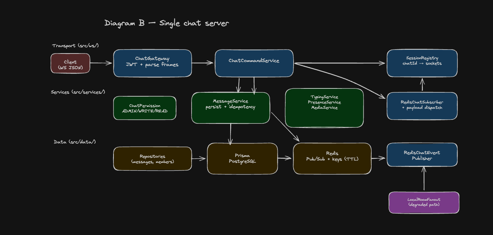
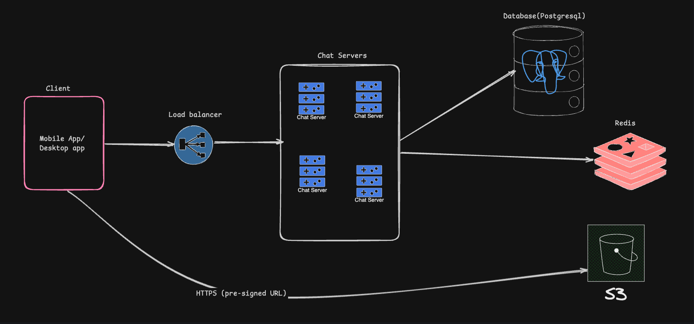

# Flow Chat Backend
> **TL;DR** — Real-time chat over WebSockets (Bun + TypeScript). Messages persist to **PostgreSQL**, fan out via **Redis Pub/Sub** across horizontally-scalable nodes. JWT auth with three roles. Supports typing indicators, presence heartbeats, idempotent sends, and read receipts.

---

| Question | Answer |
|----------|--------|
| **What are you using for WebSockets?** | Node’s `http` server + the **`ws`** package (`WebSocketServer`, per-connection handlers). Auth on upgrade (JWT query or `Authorization: Bearer`). JSON frames routed through a thin gateway into services. |
| **Other message types (audio, documents, …)?** | `MessageType` enum: `TEXT`, `IMAGE`, `AUDIO`, `FILE`. **No binary over WS:** clients get a mock pre-signed upload (`request_presigned_upload` + `MediaService`), upload to object storage, then `send_message` with `content` = public URL and matching type. `FILE` covers documents; MIME rules live in `MediaService`. |
| **How do we know someone is typing?** | Clients send `typing_start` / `typing_stop`. Server sets Redis keys `typing:{chatId}:{userId}` with TTL, publishes on Redis Pub/Sub, other nodes broadcast `typing` events to joined room members. READ-only members cannot start/stop typing (enforced with send). |
| **Admin vs Read vs Write?** | `chat_members.role` = `ADMIN` \| `WRITE` \| `READ` (Postgres). `ChatPermissionService`: READ cannot send / type / presigned upload; WRITE can send; ADMIN full control + `requireAdmin` hook for stricter ops. Checked before business logic runs. |

## Message flow

1. Client sends a `send_message` WS frame with a `clientGeneratedId`.
2. `ChatGateway` parses and delegates — no business logic in the handler.
3. `MessageService` checks WRITE/ADMIN permission, validates, persists to Postgres.
4. Publishes to Redis channel `chat:<chatId>`.
5. Every node subscribes to `chat:*` and broadcasts to local sockets that have `join_chat`'d that room.
6. Sender also gets a `message_delivered` ACK on their connection.

Typing, presence, and read receipts follow the same **publish → subscribe → local broadcast** path.

---

## Architecture

| Layer | Responsibility |
|---|---|
| `src/ws/` | Connections, JWT auth, JSON routing, per-process room registry |
| `src/services/` | Permissions, messages, typing, presence, media URLs |
| `src/data/` | Prisma repos, Redis command + Pub/Sub clients |

### Diagrams (Excalidraw)

<!-- **Diagram A — system context** (client, load balancer, chat server pool, PostgreSQL, Redis, S3 + pre-signed upload path): -->
**Diagram A — single chat server (internal)** (components and data flow inside one node):



**Diagram B — system context** (client, load balancer, chat server pool, PostgreSQL, Redis, S3 + pre-signed upload path):



---

## Scaling

- **Horizontal WS tier** — nodes are stateless except for local room membership; no sticky sessions needed.
- **Fan-out** — one Redis publish per event; subscribers filter by `chatId` in the payload.
- **Pagination** — messages have a monotonic `sequence` per chat, indexed on `(chatId, sequence)` and `(chatId, createdAt)`.
- **Future** — swap Redis Pub/Sub for Kafka/Redis Streams for multi-region or strict ordering; keep Postgres as system of record.

---

## Key tradeoffs

| Topic | Choice | Why |
|---|---|---|
| Redis vs Kafka | Redis Pub/Sub | Lower latency, simpler ops; Postgres handles replay |
| Read receipts | `last_read_message_id` cursor + optional `message_read_receipts` table | O(1) cursor updates; per-message rows scale with messages × readers |
| WS vs polling | WebSocket | Better latency/overhead for typing/presence |
| Media | Pre-signed URLs, URL-in-message | Keeps large payloads off the socket |

---

## Failure modes

| Failure | Behavior |
|---|---|
| Redis publish fails (after DB commit) | Logs warning, fans out to local node only; other nodes miss event until Redis recovers |
| Redis entirely down | DB writes may succeed; typing/presence fail fast — treat Redis as a hard dependency |
| WS disconnect mid-send | Frame fails Zod validation → structured `error` event; retry with same `clientGeneratedId` (idempotent) |
| Duplicate delivery | Clients dedupe on `message.id`; duplicate sends absorbed by `(chatId, clientGeneratedId)` uniqueness |
| Reconnect / missed events | Pull catch-up via `GET /chats/:id/messages?afterSequence=…` (not yet implemented; use existing Prisma models) |

---

## Security

- JWT validated once on WS upgrade (`Authorization: Bearer` or `?token=`).
- RBAC runs in the service layer on every command — transport stays thin.
- All inbound events validated with Zod schemas.
- `AppError` → structured JSON errors.
- **Not yet wired:** rate limiting, per-IP quotas, message size caps — recommended before public deployment.

---

## Setup

**Prerequisites:** Bun 1.2+, Docker (optional)

### Option A — Docker Compose (recommended)

```bash
docker compose up --build
docker compose exec app bun run db:seed   # prints chatId + JWTs
curl http://localhost:8080/health
```

Connect: `ws://localhost:8080?token=<JWT>` → `join_chat` → send events.

### Option B — Local Bun + Docker infra only

```bash
docker compose up postgres redis -d
cp .env.example .env
bun install && bun run db:generate && bun run db:migrate && bun run db:seed
bun run dev
```

---

## Environment variables

| Variable | Description |
|---|---|
| `DATABASE_URL` | Postgres connection string |
| `REDIS_URL` | e.g. `redis://localhost:6379` |
| `JWT_SECRET` | ≥ 32 chars |
| `PORT` | Default `8080` |
| `NODE_ENV` | `development` / `production` / `test` |
| `MOCK_S3_BUCKET_BASE_URL` | Base URL for mock pre-signed upload responses |

---

## WebSocket events

**Auth:** `Authorization: Bearer <jwt>` on upgrade, or `?token=<jwt>` in URL.  
On connect you receive `{"type":"connected","userId":"..."}`.

### Client → server

| `type` | Payload |
|---|---|
| `join_chat` | `{ chatId }` — required to receive room events |
| `leave_chat` | `{ chatId }` |
| `send_message` | `{ chatId, clientGeneratedId, messageType, content, metadata? }` |
| `typing_start` / `typing_stop` | `{ chatId }` — WRITE/ADMIN only |
| `presence_heartbeat` | `{}` — refreshes `online:<userId>` in Redis |
| `mark_messages_read` | `{ chatId, messageIds }` |
| `request_presigned_upload` | `{ chatId, fileName, mimeType, messageType }` |

Media: send content as an `https://` URL after upload — no binaries over the socket.

### Server → client

`message` · `message_delivered` · `typing` · `messages_read` · `presigned_upload` · `error`

### Quick manual test

Two terminals, two different JWTs from seed. Both send `join_chat`. Terminal A sends `typing_start` → Terminal B receives a `typing` event. Terminal A sends `send_message` → both receive `message`, Terminal A also receives `message_delivered`.

---

## Scripts

| Script | Purpose |
|---|---|
| `bun run dev` | Watch mode |
| `bun run db:generate` | Prisma client → `generated/prisma` |
| `bun run db:migrate` | Create/apply migrations (dev) |
| `bunx prisma migrate deploy` | Apply migrations (CI/Docker) |
| `bun run db:seed` | Demo users, chat, JWTs |

---